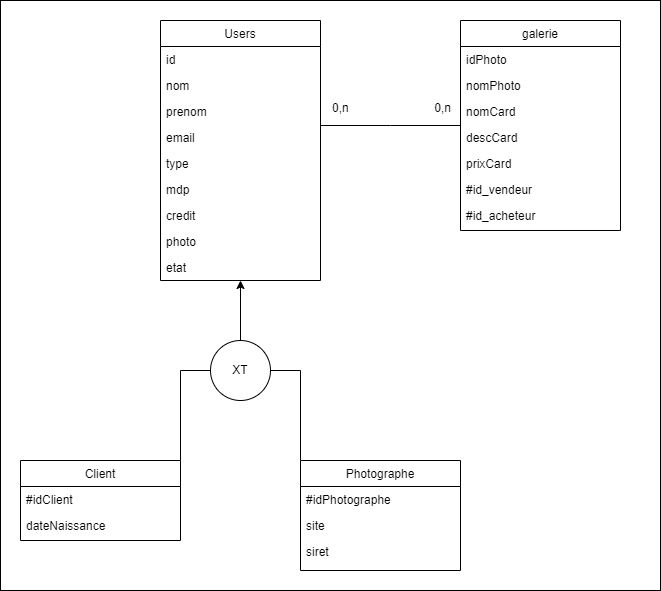
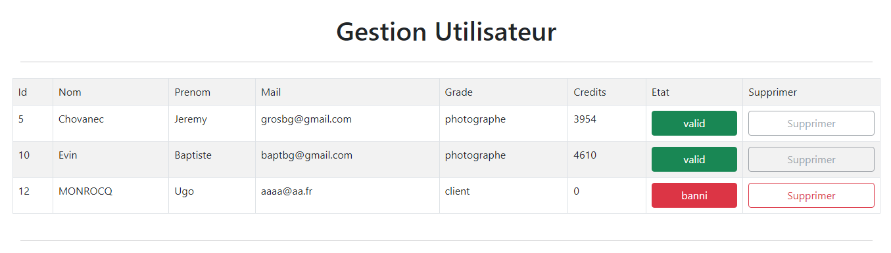

# PhotoForYou : site pour la vente et l'achat de photos d'Artistes

## Présentation générale

>PhotoForYou est un site de banque d'images en ligne. Il permet à des visiteurs lamba de voir les images proposées. 
>Les clients connectés peuvent acheter des photos avec leur soldes et les photographes peuvent en plus poster des photos sur le site 
>et toucher une commission sur chaque vente.
---

## Expression fonctionelle du besoin

>### Description du contenu
>
>>- Enregistrement sur le site en tant que photographe ou client.
>>- La désinscription (cela entraine la perte des crédits et pour un photographe et le retrait de toutes ses photos du catalogue)
>>- Gestion du caddie
>>- Les photos achetées sont archivées chez le client et téléchargeables à tous moments
>>- Le photographe fixe le prix de vente en nombre de crédit. (minimum 2 crédits-maximum 100 crédits)
>>- Les photos sont en vente de manière exclusive (un seul achat après retrait du catalogue)
>>- L’achat se fait à partir de crédits que l’on doit acheter. (1 crédit = 5 euros)

## Exigences fonctionnelles

>### <ins>Principales composantes</ins>
>>- Gestion des utilisateurs
>>- Identification des utilisateurs
>>- Gestion de l'espace client/photographe
>>- Gestion des commandes
>>- Gestion de paiements
>>- Gestion du catalogue
>
>### <ins>Fonctionnalités en "front office"</ins>
>>- Identification
>>- Gestion de l'espace photographe
>>- Gestion de l'esapce client
>>- Gestion des commandes
>>- Catalogue des photos
>
>### <ins>Fonctionnalités en "back-office"</ins>
>>- Gestion des utilisateurs
>>- Gestion du contenu informationnel
>>- Gestion du catalogue

## MLD

>- Users (<ins>id</ins>, nom, prenom, email, type, mdp, credit, photo);
>- Client (<ins>#idClient</ins>, dateNaissance);
>- Photographe (<ins>#idPhotographe</ins>, site, siret);

## SCD

>

## Diagramme de cas d'utilisation

>

## Apercu du site

>### Page d'accueil :
>>
>> 
>
>### Page d'inscription :
>> On est renvoyé sur cette page quand on clique sur un des boutons "S'incrire" sur le site. On à le choix lors de l'inscription de s'inscrire soit en tant que client soit en temps que photographe.
>>
>> 
>
>### Page de connexion :
>> On est renvoyé sur cette page quand on clique sur un des boutons "Se connecter sur le site ou si l'on tente d'accèder à la page "Acheter" sans être authentifié. La navbar change en fonction de si l'on est connecter en tant que photographe ou client, ou alors pas du tout authentifié.
>> 
>> 
>
>### Page d'achat :
>>Page vitrine de photos, où l'on peut visionner les photos en vente et acheter celles que l'on veut, en fonction du nombre de crédits en notre possession.
>>
>>
>
>### Page Vente :
>>Page pour les photographes uniquement, où ils peuvent poster les images et donner un titre, une description et un prix personnalisé.
>>
>>
>
>### Profil utilisateur
>>Page où l'on peut consulter les informations de son compte, son type de compte, son solde de crédits et en rajouter, voir la photo acheté sur son compte et supprimer son compte définitivement.
>>
>>
>
>### Gestion des utilisateurs
>>Page spécial uniquement accèssible par l'administrateur du site. On peut voir les informations des personnes inscrits sur le site et on peut les bannir du site, ce qui les empêche de se connecter, jusqu'à ce qu'un débanissement soit effectuer.
>>
>>

